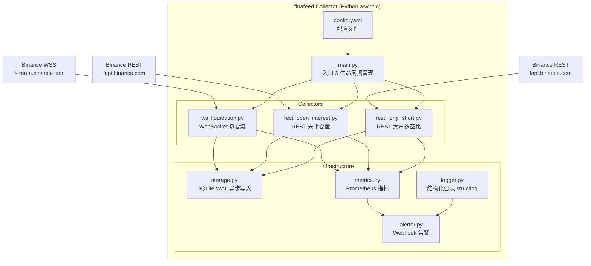

# finafeed 7×24 数据采集守护进程

将现有 finafeed 前端看盘系统的**数据采集**能力抽离为独立的守护进程，部署在东京 VPS 上实现 7×24 无人值守运行。

---

## User Review Required

> [!IMPORTANT]
> **技术栈选择：Python asyncio**
> 考虑到你的需求（低延迟流处理 + REST 定时轮询 + 7×24 守护进程 + VPS 部署），推荐使用 **Python 3.11+ asyncio** 而非 Node.js，原因：
>
> - `asyncio` 原生支持高并发 WebSocket + HTTP 调度，单线程无阻塞
> - `aiosqlite` 提供异步 SQLite 访问，WAL 模式下写入性能优秀
> - `systemd` 原生进程管理，比 pm2 更适合 Linux daemon
> - VPS 上 Python 环境更轻量，无需 Node.js 构建链
> - `prometheus_client` / `structlog` 等成熟的可观测库

> [!WARNING]
> **存储格式选择**
> 计划使用 **SQLite WAL 模式**。对于 VPS 上的单进程采集场景，SQLite 比 PostgreSQL/MySQL 更省资源且零运维。若未来需要多进程写入或远程查询，可迁移到 PostgreSQL。

> [!IMPORTANT]
> **Alert 推送通道**
> 计划支持 **Webhook (Discord/飞书/Telegram)** 作为告警通道。你需要告诉我用哪个平台？或者先只做日志告警，后续再接入？

## Open Questions

> [!IMPORTANT]
>
> 1. **VPS 上的 Python 版本？** 需要 3.11+，你的东京 VPS 是什么系统？(Ubuntu/Debian/CentOS?)
> 2. **默认监控哪些 symbol？** 配置文件里需要一个默认列表，比如 `["BTCUSDT", "ETHUSDT"]`？
> 3. **数据保留策略？** SQLite 文件无限增长还是定期清理？比如保留最近 90 天？
> 4. **采集的数据是否需要远程同步到你本地？** 比如通过 rsync / scp 定时拉取 `.db` 文件？
> 5. **Prometheus metrics 是否需要暴露 HTTP 端口？** 还是仅写入日志文件？

---

## 系统架构



---

## 技术栈

| 层级        | 技术                     | 理由                               |
| ----------- | ------------------------ | ---------------------------------- |
| 运行时      | Python 3.11+ asyncio     | 原生异步、GIL 友好的 I/O 密集场景  |
| WebSocket   | `aiohttp`                | 成熟的异步 WS 客户端，支持自动重连 |
| HTTP 客户端 | `aiohttp.ClientSession`  | 连接池复用、非阻塞                 |
| 存储        | `aiosqlite` + SQLite WAL | 零运维、省内存、高写入吞吐         |
| 日志        | `structlog` + JSON       | 结构化日志，便于 grep/jq 分析      |
| 指标        | `prometheus_client`      | 标准可观测方案，可选暴露 HTTP      |
| 告警        | `aiohttp` webhook        | 异常时推送到 Discord/Telegram      |
| 进程管理    | `systemd`                | Linux 原生守护进程，自动重启       |
| 配置        | `pyyaml`                 | YAML 配置文件                      |

---

## 数据采集规格

### 1. 爆仓数据 (WebSocket Stream)

| 项目      | 详情                                                                                                                   |
| --------- | ---------------------------------------------------------------------------------------------------------------------- |
| 端点      | `wss://fstream.binance.com/market/stream?streams=<symbol>@forceOrder`                                                  |
| 频率      | 实时推送，1000ms 内最多 1 条快照                                                                                       |
| 数据模型  | `symbol, side, order_type, time_in_force, qty, price, avg_price, status, last_qty, filled_qty, trade_time, event_time` |
| 存储策略  | 每条消息立即写入 (批量 buffer 100ms)                                                                                   |
| 重连策略  | 指数退避 1s→2s→4s→8s→30s (cap)，永不放弃                                                                               |
| 多 symbol | 每个 symbol 一个独立 WS 连接 (分片隔离)                                                                                |

### 2. 未平仓合约数 (REST Polling)

| 项目     | 详情                                                                |
| -------- | ------------------------------------------------------------------- |
| 端点     | `GET https://fapi.binance.com/fapi/v1/openInterest?symbol=<SYMBOL>` |
| 频率     | 每 5 秒轮询                                                         |
| 权重     | 1/请求                                                              |
| 去重     | 与上次 `openInterest` 值比较，相同则跳过写入                        |
| 数据模型 | `symbol, open_interest, time, collected_at`                         |

### 3. 大户持仓量多空比 (REST Polling)

| 项目     | 详情                                                                                                      |
| -------- | --------------------------------------------------------------------------------------------------------- |
| 端点     | `GET https://fapi.binance.com/futures/data/topLongShortPositionRatio?symbol=<SYMBOL>&period=5m&limit=500` |
| 频率     | 每 2500 分钟 (≈41.67 小时)                                                                                |
| 权重     | 0 (不计入限频)                                                                                            |
| 数据模型 | `symbol, long_short_ratio, long_account, short_account, timestamp`                                        |
| 日志     | 每次采集打印完整日志 (采集时间、返回条数、首末时间戳)                                                     |

---

## Proposed Changes

### 项目结构

```
finafeed/
├── collector/                    # 新增：数据采集独立模块
│   ├── __init__.py
│   ├── main.py                   # 入口：生命周期、信号处理、任务编排
│   ├── config.yaml               # 配置：symbols、间隔、数据库路径、告警
│   ├── config.py                 # 配置加载 & 校验
│   ├── storage.py                # SQLite WAL 异步读写、建表、去重
│   ├── collectors/
│   │   ├── __init__.py
│   │   ├── ws_liquidation.py     # WebSocket 爆仓流采集器
│   │   ├── rest_open_interest.py # REST 未平仓量采集器
│   │   └── rest_long_short.py    # REST 大户多空比采集器
│   ├── infra/
│   │   ├── __init__.py
│   │   ├── logger.py             # structlog 配置
│   │   ├── metrics.py            # Prometheus 指标定义
│   │   └── alerter.py            # Webhook 告警
│   ├── requirements.txt          # Python 依赖
│   └── deploy/
│       ├── finafeed-collector.service  # systemd 单元文件
│       └── README.md                     # 部署文档
```

---

### 核心组件

#### [NEW] collector/main.py

- 入口点，`asyncio.run()` 启动
- 加载配置，初始化 DB/日志/指标
- 为每个 symbol 创建 3 个采集任务 (WS + 2 REST)
- `asyncio.gather()` 并发运行所有任务
- 注册 `SIGTERM`/`SIGINT` 信号处理，优雅关闭
- 全局异常兜底 + 告警

#### [NEW] collector/config.yaml

```yaml
symbols:
  - BTCUSDT
  - ETHUSDT

database:
  path: ./data/finafeed.db
  wal_mode: true

collectors:
  liquidation:
    enabled: true
    buffer_ms: 100 # 批量写入缓冲

  open_interest:
    enabled: true
    interval_sec: 5
    dedup: true # 值不变时跳过写入

  long_short_ratio:
    enabled: true
    period: "5m"
    limit: 500
    interval_min: 2500

reconnect:
  initial_delay_sec: 1
  max_delay_sec: 30
  backoff_factor: 2

metrics:
  enabled: true
  port: 9090 # Prometheus HTTP 端口

alert:
  enabled: false
  webhook_url: "" # Discord/Telegram webhook
  alert_on:
    - ws_disconnect_5min
    - rest_fail_3_consecutive
    - db_write_error

logging:
  level: INFO
  format: json
  file: ./logs/collector.log
  rotation: "50 MB"
  retention: 30 # 天
```

#### [NEW] collector/config.py

- 使用 `pyyaml` + `dataclass` 加载并校验配置
- 支持环境变量覆盖 (如 `finafeed_SYMBOLS=BTCUSDT,ETHUSDT`)

#### [NEW] collector/storage.py

- `aiosqlite` 异步连接管理
- 启动时 `PRAGMA journal_mode=WAL; PRAGMA synchronous=NORMAL;`
- 三张表：`liquidations`, `open_interest`, `long_short_ratio`
- 批量 INSERT 使用 `executemany`
- Open Interest 去重：内存缓存上次值，值相同则 skip

```sql
CREATE TABLE IF NOT EXISTS liquidations (
    id INTEGER PRIMARY KEY AUTOINCREMENT,
    symbol TEXT NOT NULL,
    event_time INTEGER NOT NULL,
    trade_time INTEGER NOT NULL,
    side TEXT NOT NULL,
    price REAL NOT NULL,
    avg_price REAL NOT NULL,
    qty REAL NOT NULL,
    filled_qty REAL NOT NULL,
    collected_at INTEGER NOT NULL
);
CREATE INDEX IF NOT EXISTS idx_liq_symbol_time ON liquidations(symbol, event_time);

CREATE TABLE IF NOT EXISTS open_interest (
    id INTEGER PRIMARY KEY AUTOINCREMENT,
    symbol TEXT NOT NULL,
    open_interest REAL NOT NULL,
    api_time INTEGER NOT NULL,
    collected_at INTEGER NOT NULL
);
CREATE INDEX IF NOT EXISTS idx_oi_symbol_time ON open_interest(symbol, api_time);

CREATE TABLE IF NOT EXISTS long_short_ratio (
    id INTEGER PRIMARY KEY AUTOINCREMENT,
    symbol TEXT NOT NULL,
    long_short_ratio REAL NOT NULL,
    long_account REAL NOT NULL,
    short_account REAL NOT NULL,
    data_timestamp INTEGER NOT NULL,
    collected_at INTEGER NOT NULL
);
CREATE INDEX IF NOT EXISTS idx_lsr_symbol_time ON long_short_ratio(symbol, data_timestamp);
```

#### [NEW] collector/collectors/ws_liquidation.py

- 每个 symbol 独立的 `async` 协程
- 使用 `aiohttp.ClientSession.ws_connect()` 连接
- 收到消息后解析 forceOrder → 写入 buffer
- 100ms flush buffer 到 DB（batch insert）
- 断开时触发指数退避重连
- Prometheus 计数器: `liq_messages_total`, `ws_reconnects_total`
- 心跳检测：若 >5min 无消息 → 告警（某些 symbol 爆仓本身就很稀疏，但 WS 应有 pong）

#### [NEW] collector/collectors/rest_open_interest.py

- `asyncio.sleep(5)` 循环
- 每次请求 `/fapi/v1/openInterest?symbol=<SYMBOL>`
- 与内存中上次值比较，不同才写入
- 请求失败时指数退避重试，连续 3 次失败 → 告警
- Prometheus 计数器: `oi_polls_total`, `oi_writes_total`, `oi_skips_total`

#### [NEW] collector/collectors/rest_long_short.py

- `asyncio.sleep(2500 * 60)` 循环（2500 分钟）
- 请求 `/futures/data/topLongShortPositionRatio?symbol=<SYMBOL>&period=5m&limit=500`
- 每次采集打印详细日志：
  ```
  [2026-05-07 08:30:00] LONG_SHORT_RATIO symbol=BTCUSDT rows=500
  first_ts=2026-05-05T12:00:00 last_ts=2026-05-07T08:25:00
  latest_ratio=1.4342 elapsed_ms=234
  ```
- 批量写入 500 条记录（使用 `INSERT OR IGNORE` 按 timestamp 去重）
- Prometheus: `lsr_polls_total`, `lsr_rows_inserted`

#### [NEW] collector/infra/logger.py

- `structlog` 配置，JSON 格式输出
- 文件日志 + 控制台日志
- 日志轮转 (50MB per file, 保留 30 天)
- 每条日志包含 `symbol`, `collector`, `timestamp` 上下文

#### [NEW] collector/infra/metrics.py

- `prometheus_client` 定义所有计数器和直方图
- 可选暴露 HTTP `/metrics` 端口
- 关键指标：
  - `collector_messages_total{type, symbol}` — 消息计数
  - `collector_errors_total{type, symbol}` — 错误计数
  - `collector_ws_connected{symbol}` — WS 连接状态 (gauge)
  - `collector_db_write_latency_seconds` — 写入延迟
  - `collector_last_activity_timestamp{type, symbol}` — 最后活动时间

#### [NEW] collector/infra/alerter.py

- 异步 Webhook 推送
- 告警条件：WS 断连超 5 分钟、REST 连续 3 次失败、DB 写入错误
- 告警去重：同一条件 10 分钟内不重复告警
- 恢复通知：故障恢复后发送恢复消息

#### [NEW] collector/requirements.txt

```
aiohttp>=3.9.0
aiosqlite>=0.19.0
structlog>=24.0.0
prometheus-client>=0.20.0
pyyaml>=6.0
```

#### [NEW] collector/deploy/finafeed-collector.service

```ini
[Unit]
Description=finafeed Data Collector
After=network.target

[Service]
Type=simple
User=finafeed
WorkingDirectory=/opt/finafeed/collector
ExecStart=/opt/finafeed/venv/bin/python main.py
Restart=always
RestartSec=5
StandardOutput=journal
StandardError=journal

[Install]
WantedBy=multi-user.target
```

#### [NEW] collector/deploy/README.md

- VPS 部署步骤
- systemd 启停命令
- 日志查看
- 数据库备份
- 配置热更新

---

## 关键设计决策

### 1. 多 Symbol 并发模型

```python
async def main():
    config = load_config()
    db = await init_database(config)

    tasks = []
    for symbol in config.symbols:
        tasks.append(collect_liquidations(symbol, db))
        tasks.append(collect_open_interest(symbol, db))
        tasks.append(collect_long_short_ratio(symbol, db))

    await asyncio.gather(*tasks, return_exceptions=True)
```

每个 symbol × 每种数据源 = 1 个独立协程，互不干扰。

### 2. WebSocket 重连策略

```
断开 → 等待 1s → 重连 → 失败 → 等待 2s → 重连 → 失败 → 等待 4s → ... → cap at 30s
重连成功 → 重置延迟到 1s
连续断开 5min → 触发告警
```

### 3. Open Interest 去重

```python
last_oi = {}  # symbol → last_value

async def poll_oi(symbol):
    data = await fetch_oi(symbol)
    if data["openInterest"] != last_oi.get(symbol):
        await db.write_oi(data)
        last_oi[symbol] = data["openInterest"]
    else:
        metrics.oi_skips.inc()
```

### 4. 优雅关闭

```python
async def shutdown(signal):
    log.info("Shutting down", signal=signal)
    # 1. 停止接收新数据
    # 2. Flush 所有 buffer 到 DB
    # 3. 关闭 WS 连接
    # 4. 关闭 DB 连接
    # 5. 发送关闭通知
```

---

## Verification Plan

### Automated Tests

1. **启动验证**: `python main.py --dry-run` 检查配置加载、DB 建表
2. **连接验证**: 启动后 10s 内检查日志确认 WS 已连接
3. **数据验证**: 运行 5 分钟后查询 DB 确认各表有数据

```bash
sqlite3 data/finafeed.db "SELECT COUNT(*) FROM liquidations;"
sqlite3 data/finafeed.db "SELECT COUNT(*) FROM open_interest;"
```

### Manual Verification

1. 在本地运行 finafeed，观察日志输出
2. 手动 `kill -SIGTERM <pid>` 验证优雅关闭
3. 断网测试：验证 WS 自动重连
4. 部署到 VPS 后，运行 24h 检查稳定性
5. 检查 Prometheus metrics 端口 `:9090/metrics`
