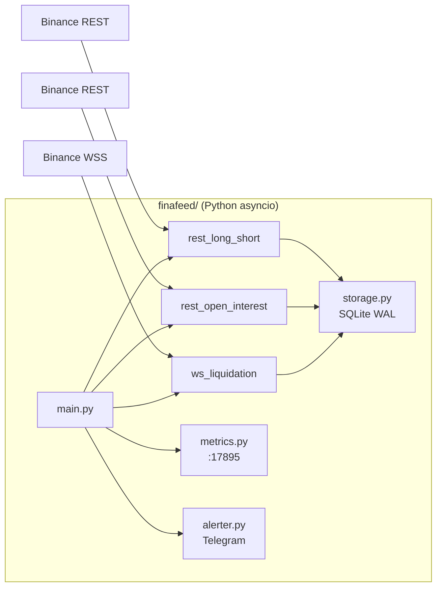

# finafeed — 实现总结

## 概述

finafeed 项目是一个独立的 **Python asyncio 数据采集守护进程**，位于 `finafeed/` 目录下。该进程设计为部署在东京 VPS 上 7×24 无人值守运行，采集币安合约的三类数据。

## 架构



## 新增文件清单

| 文件                                                                                                     | 用途                                       |
| -------------------------------------------------------------------------------------------------------- | ------------------------------------------ |
| [**init**.py](file:///c:/Users/raymo/rays/repos/_me/finafeed/__init__.py)                                | 包初始化                                   |
| [**main**.py](file:///c:/Users/raymo/rays/repos/_me/finafeed/__main__.py)                                | `python -m finafeed` 入口                  |
| [main.py](file:///c:/Users/raymo/rays/repos/_me/finafeed/main.py)                                        | 生命周期管理、信号处理、多 symbol 任务编排 |
| [config.yaml](file:///c:/Users/raymo/rays/repos/_me/finafeed/config.yaml)                                | YAML 配置 (symbols, 间隔, DB, 告警)        |
| [config.py](file:///c:/Users/raymo/rays/repos/_me/finafeed/config.py)                                    | 配置加载 + 环境变量覆盖                    |
| [storage.py](file:///c:/Users/raymo/rays/repos/_me/finafeed/storage.py)                                  | SQLite WAL 异步存储 + 800MB 轮转           |
| [ws_liquidation.py](file:///c:/Users/raymo/rays/repos/_me/finafeed/collectors/ws_liquidation.py)         | WebSocket 爆仓流 (指数退避重连)            |
| [rest_open_interest.py](file:///c:/Users/raymo/rays/repos/_me/finafeed/collectors/rest_open_interest.py) | REST 未平仓量 (5s, 值去重)                 |
| [rest_long_short.py](file:///c:/Users/raymo/rays/repos/_me/finafeed/collectors/rest_long_short.py)       | REST 大户多空比 (2500min, 详细日志)        |
| [logger.py](file:///c:/Users/raymo/rays/repos/_me/finafeed/infra/logger.py)                              | structlog JSON 日志 + 轮转                 |
| [metrics.py](file:///c:/Users/raymo/rays/repos/_me/finafeed/infra/metrics.py)                            | Prometheus 指标 (端口 17895)               |
| [alerter.py](file:///c:/Users/raymo/rays/repos/_me/finafeed/infra/alerter.py)                            | Telegram 告警 (10min 去重)                 |
| [pyproject.toml](file:///c:/Users/raymo/rays/repos/_me/finafeed/pyproject.toml)                          | uv 项目配置                                |
| [finafeed.service](file:///c:/Users/raymo/rays/repos/_me/finafeed/deploy/finafeed.service)               | systemd 服务文件                           |
| [README.md](file:///c:/Users/raymo/rays/repos/_me/finafeed/deploy/README.md)                             | VPS 部署指南                               |

## 验证结果

### Dry-run 测试 ✅

```
finafeed_starting  symbols=['BTCUSDT', 'ETHUSDT'] dry_run=True
database_opened     path=data/finafeed.db
dry_run_complete    message='Config valid, DB schema applied. Exiting.'
database_closed
```

### 实际运行测试 ✅

```
tasks_started       count=6 tasks=['liq-BTCUSDT', 'oi-BTCUSDT', 'lsr-BTCUSDT', ...]
ws_connected        symbol=BTCUSDT
ws_connected        symbol=ETHUSDT
LONG_SHORT_RATIO    symbol=BTCUSDT rows=500 inserted=500 latest_ratio=0.6894
LONG_SHORT_RATIO    symbol=ETHUSDT rows=500 inserted=500 latest_ratio=1.0232
```

### 数据库验证 ✅

| 表               | 记录数 | 说明              |
| ---------------- | ------ | ----------------- |
| open_interest    | 16     | 5s 间隔，去重正常 |
| long_short_ratio | 1000   | 2 symbols × 500   |
| liquidations     | 1      | 爆仓事件本身稀疏  |

## 部署到 VPS

详见 [deploy/README.md](file:///c:/Users/raymo/rays/repos/_me/finafeed/collector/deploy/README.md)，核心步骤：

```bash
# 上传到 VPS
scp -r ./finafeed/ user@tokyo-vps:/opt/finafeed/

# 安装依赖
cd /opt/finafeed/finafeed && uv sync

# 编辑配置 (填入 Telegram chat_id)
nano config.yaml

# 安装 systemd 服务
sudo cp deploy/finafeed.service /etc/systemd/system/
sudo systemctl daemon-reload && sudo systemctl enable --now finafeed
```

## 注意事项

> [!IMPORTANT]
> 部署前需要填入 `config.yaml` 中的 `alert.telegram.chat_id`。给 bot 发 `/start` 后访问 `https://api.telegram.org/bot<TOKEN>/getUpdates` 获取。

> [!TIP]
> 本地运行命令 (Windows): `$env:PYTHONPATH="<finafeed路径>"; uv run python -m finafeed.main`
> VPS 上 systemd 已自动设置 `PYTHONPATH=/opt/finafeed`。
